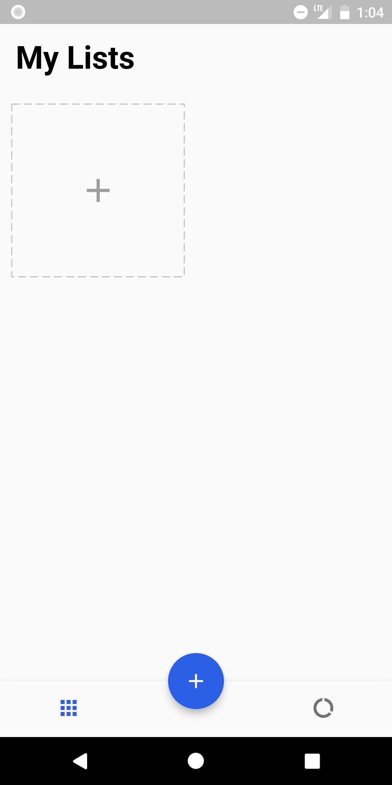
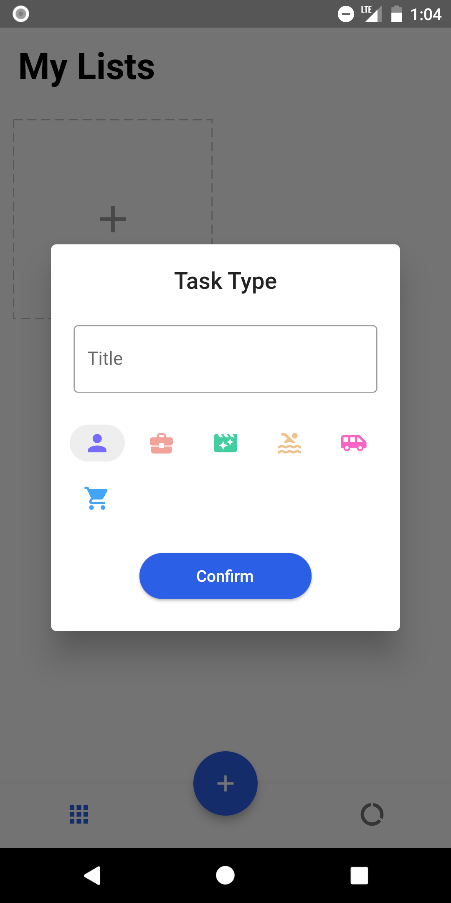
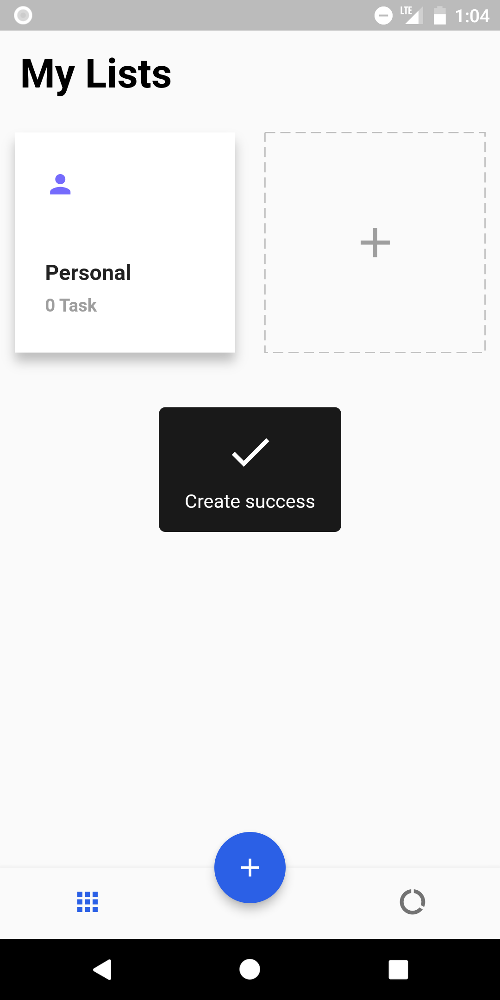
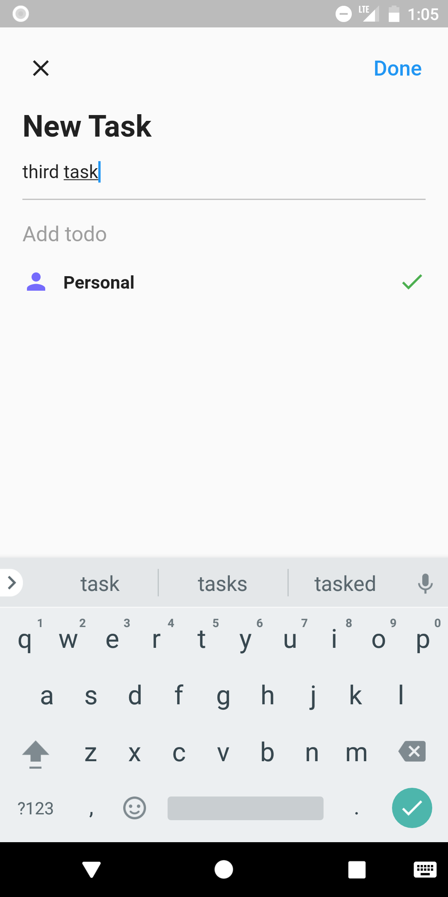
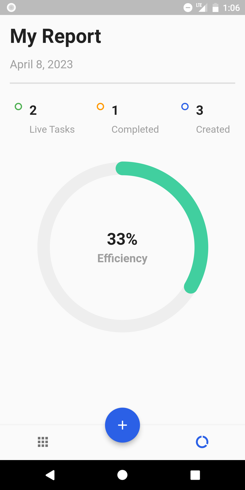

# Todo list with GetX

  
 
 
### Review

   
   
   
   
   
   
   

### Packages we are using:

[GetX :](https://pub.dev/packages/get)  GetX is an extra-light and powerful solution for Flutter. It combines high-performance state management, intelligent dependency injection, and route management quickly and practically.

[Get Storage:](https://pub.dev/packages/get_storage) A fast, extra light and synchronous key-value in memory, which backs up data to disk at each operation. It is written entirely in Dart and easily integrates with Get framework of Flutter.

[equatable:](https://pub.dev/packages/equatable) Being able to compare objects in `Dart` often involves having to override the `==` operator as well as `hashCode`.

[Dotted Border:](https://pub.dev/packages/dotted_border) A flutter package to easily added dotted borders around widgets.

[Step Progress Indicator:](https://pub.dev/packages/step_progress_indicator) Open source Flutter package, bar indicator made of a series of selected and unselected steps.

intl:- [Link:](https://pub.dev/packages/agora_rtc_engine) Contains code to deal with internationalized/localized messages, date and number formatting and parsing, bi-directional text, and other internationalization issues.

